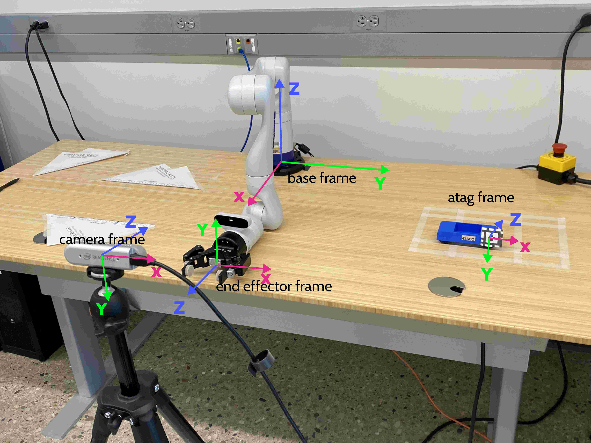

## **Camera Calibration Objective**

Determine the **Camera pose in Base frame** (Camera Extrinsics), to compute the locations of object in base frame based on the camera frame.
In other words, we want to determine the homogeneous transformation matrix from the camera frame to the base frame, as depicted below. 

See below for more details on the procedure as well as additional resources (notes)
on how camera calibration works.

## Usage

1. Turn on the Kinova arm with Apriltag attached to the End Effector.
2. Place the Intel RealSense D435 in a position where the region of interest can been seen. You can use the Ubuntu application Cheese to check the camera view. 
3. (IMPORTANT) Go to the section "Robot->Arm" in Kinvoa Web Application, switch the "End Effector Type" to "Not installed".
4. Run the script **camera_calibration_mulit_pose_beta.py** to perform the camera calibration. The estimated camera extrinsics would be saved in file **camera_extrinsics.npy**.
5. Use the following two scripts to evaluate the accuracy of the estimated camera extrinsics: **camera_calibration_multi_pose_verify.py** and **camera_detect_car_verify.py**. Check out the next section for usage.

The calibration accuracy can be improved by increasing the values of `n_sample` (# AprilTag detections per EE pose) and `total_cnt` (# EE poses) in  **camera_calibration_mulit_pose_beta.py**, while the execution time can be reduced by decreasing the values of these two variables.

## Evaluation

To run the script **camera_calibration_multi_pose_verify.py**, follow steps 1-3 in the previous section if they have not been done. This script compares the end effector pose in base frame estimated based on (AprilTag detection + provided camera extrinsics) with the measurement of the Kinova arm. The estimation error ("Rotation Estimate Error" and "Translation Estimate Error") will be printed in the terminal. If the calibration is done correctly, the infinity norm of the translation error should be less than 3mm.  

To run the script **camera_detect_car_verify.py**, take the following steps first:

1. Remove the AprilTag from the End Effector, and install the gripper.  
2. (IMPORTANT) Go to the section "Robot->Arm" in Kinvoa Web Application, switch the "End Effector Type" to "Robotiq 2F-85 gripper, 2fingers".
3. Place an object (such as a car) with AprilTag attached at a location where the gripper can reach
4. Run the script and check if the gripper moves to the above of the object.

## Calibration **Procedure** Explained 

1. Attach an AprilTag to Kinova Arm’s End Effector
2. Correct the distortion of camera → Not needed for Intel RealSense D435
    
    https://docs.opencv.org/4.x/dc/dbb/tutorial_py_calibration.html
    
    “For Intel RealSense D435 camera, its two infrared streams have no distortion. Therefore, this specific function doesn't not necessarily need to be used.”
    

**The script camera_calibration_multi_pose_beta.py loops through steps 3-8 for a number of different poses and takes average of them**

3. Move the arm to a position where AprilTag can be seen by the camera
4. Detect the AprilTag pose within the captured frames from camera
5. Average out the **AprilTag pose in Camera frame**
6. Use forward kinematics to compute the **End Effector pose in Base frame**
7. Compute the **Camera pose in Base frame** using “AprilTag pose in Camera frame” and “End Effector pose in Base frame”, assuming AprilTag pose = End Effector pose

$$
\text{Assume: } X^A = X^E
$$

$$
X^A = X^C\ ^CX^A
$$

$$
\text{ Then, } X^C = X^E (^CX^A)^{-1}
$$

9. Save the determined extrinsics to .npy file for reuse
10. Validate the determined extrinsics are reasonable by running the evaluation scripts. 

## Troubleshooting

- Make sure you switch the "End Effector Type" to "Not installed" **before** calibration, and switch it back to "Robotiq 2F-85 gripper, 2fingers" **after** calibration.
- Make sure the variable `tag_size` in scripts matches the actual size of your AprilTag.
- The calibration accuracy degrades significantly when the distance between the camera and the tag increases. 
    - You can examine the AprilTag detection accuracy via the plot of `X_cam_ee` when running the script **camera_calibration_multi_pose_beta.py**
    - You can adjust the distance between the AprilTag (End Effector) and the camera in the calibration process by modifying the parameters in the EE pose generation (lines 24-29 in **static_controller.py**).
- Fetch the camera frame of its maximum resolution 1920x1080. This is the default setup in all the aforementioned scripts, but some scripts in the repo may use 680x480 (which should be corrected before execution). 

## Obsolete code

The scripts **camera_calibration_multi_pose.py** and **camera_calibration_single_pose.py** are obsolete. Do not use them for camera calibration. 

The scripts **camera_detect_apriltag.py** (multiple captures averaging) or **camera_stream_apriltag.py** (stream every captures) are obsolete as well, but you can use them to test the AprilTag detection pipeline. 

## Appendices
- **Intel RealSense D435i camera Specification**

    - Ideal range: 0.3 m to 3 m
    - Depth Field of View (FOV): 87° × 58°
    - Depth output resolution: Up to 1280 × 720
    - Depth frame rate: Up to 90 fps
    - Depth technology: Stereoscopic
    - Minimum depth distance (Min‑Z) at max resolution: ~28 cm
    - Depth Accuracy: <2% at 2 m
    - RGB sensor FOV (H × V): 69° × 42°
    - RGB sensor resolution: 2 MP
    - RGB frame resolution: 1920 × 1080
    - RGB frame rate: 30 fps
- [Haechan's Detailed Report](https://www.notion.so/Camera-Calibration-with-AprilTag-c6ec149b0aee4b78b16f48a3809c3222)